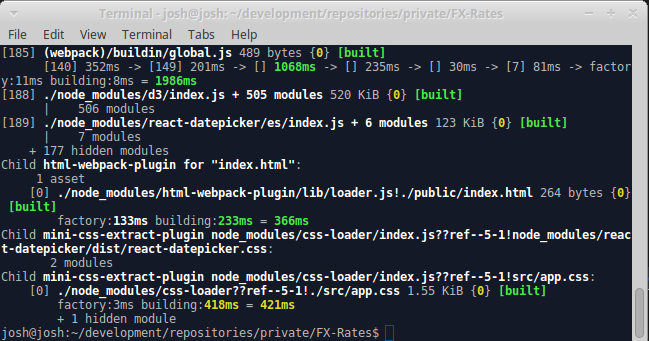

# FX Rates
Interface that displays a summary of the FX rates of currency against other currencies.
## Technical requirements
- Use fixer.io as your API
- You may do vanilla js, or any framework of your choice
- Have a build process that creates a single minified js file
## Expected results
- Historical view of fx rates on a graph
- Fast loading (less than 5s)
- Easy setup (starting the project should take less than 5 mins)
- Good documentation
- Follow a code style guide
## Resources
- Recommended Frameworks: vuejs.org, reactjs.org
- Plotting Framework: c3js.org
- Build process: https://css-tricks.com/gulp-for-beginners/


#### Build process
- Clone repo from: https://github.com/yexhoo/FX-Rates.git
- Once the download is finished, open a terminal and execute next command.
```sh
$ npm install
```

<p align="center"></p>

- To generate bundle file, execute next command
```sh
$ npm run-script build
```
- you will get something like this

<p align="center"></p>

- The 'dist' folder must contain the following files
-- FX_Rates_Bundle.js
-- index.css
-- index.html

<p align="center"></p>

- You can open the index.html file to get the next screen

<p align="center"></p>

#### How to use

- You can search and select a currency

<p align="center"></p> 

- You can search and select currencies to compare

<p align="center"></p> 

- You can select a date

<p align="center"></p> 

- You can click on "Show Historical"

<p align="center"></p> 

#### Used Tools
- React -> 6.3.2
- Webpack -> 4.7.0 
- Axios -> 0.18.0
- kenshooui/react-multi-select -> 1.0.57 
- C3 -> 0.6.7
- React-datepicker -> 1.6.0
- Fixer.io 

#### Terms of use
- Because we have a free license of Fixer.io it is only possible to compare the currency "EUR" against other currencies.

<p align="center"></p>  

<p align="center"></p> 

- If you have a Fixer.io license (API KEY) available, then you can substitute that value in the source code in the FixerEndpointBuilder.js file and generate the packaging process again.

<p align="center"></p>  


